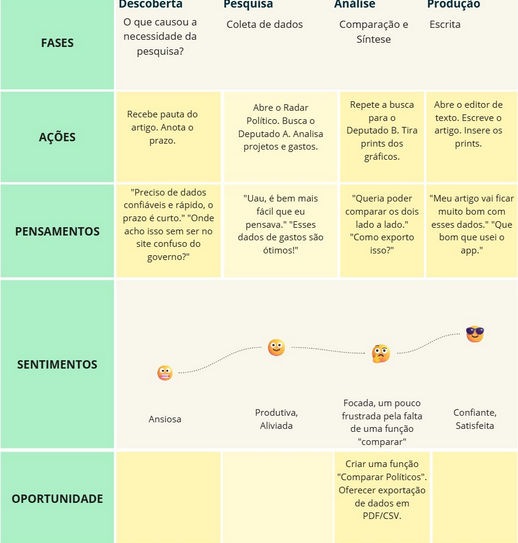
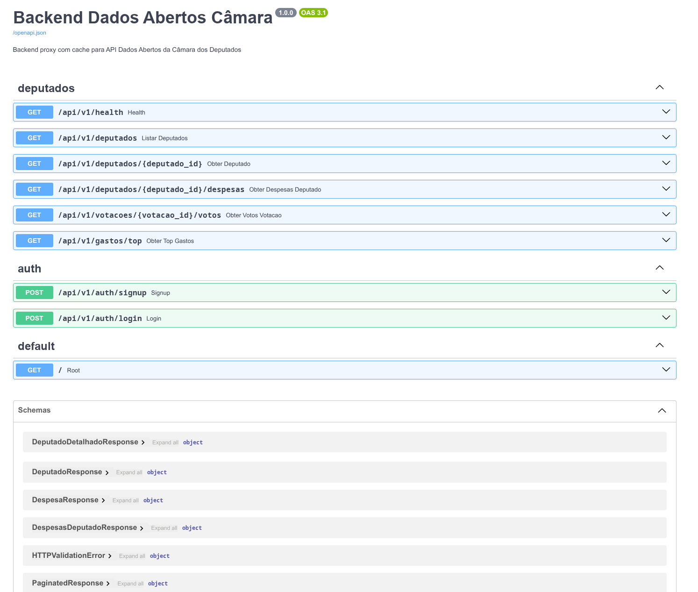

# Bem-vindo ao Radar Político

## Aos Professores do SENAC

### Integrantes do Grupo:

Leandro Santos, Lorena Amaral De Almeida, Marcelo de Barros, Nicoli Caetano Da Silva, Rafaela Gomes Dos Santos, Rosana Soares De Aguiar.

### **O vídeo de apresentação deste projeto pode ser acessado em: https://youtu.be/rjIXZth7sR8**
### **Teste o radar político ao vivo em:**
## Sobre o projeto

O **Radar Político** é um projeto desenvolvido por estudantes do **SENAC**. O objetivo do projeto é encurtar o caminho do cidadão que se interessa por política até o deputado de seu interesse. Através do Radar Político, usuários consultarão os dados do deputado que quiserem, bem como todos os detalhes de sua candidatura.

### Jornada escolhida: Sofia

Para a prova de conceito deste projeto, retornamos ao documento de desenvolvimento e escolhemos a jornada de usuário da Sofia, uma jornalista que precisa de informações sobre um deputado específico.

## Sobre este repositório

Organizamos o repositório da melhor forma para atender às boas práticas do mercado. Abaixo, poderá observar que nosso projeto exibe duas pastas: `backend` e `frontend`. A seguir explicarei as funcionalidades e os autores de cada parte do projeto.

### Sobre o backend

**Desenvolvedores:** Leandro Santos, Marcelo de Barros.

O Backend é um reverse proxy da Câmara dos Deputados. Utilizamos o FastAPI para fazer o proxy e cache dos endpoints do site oficial da câmara. Ele:

1. Faz requisições à API oficial da Câmara.
2. Cacheia respostas para reduzir as chamadas no Supabase (com fallback para TTL cache).
3. Fornece uma API REST para o frontend.
4. Implementa uma nova camada de rate limiting e tratamento de erros.

Para o projeto de backend, resolvemos criar um reverse proxy para intermediar as chamadas à API e criar o nosso próprio controle de resposta aos erros e limitações. O intuito é melhorar a experiência de usuário ao criar um ambiente isolado com regras próprias.

### Endpoints

#### Arquivos principais:

**main.py**: Aplicação FastAPI  
  - Configura o CORS  
  - Configura RateLimiting (SlowAPI)  
  - Registra as rotas (deputados, auth)  
  - Trata exceções  
  - Cria a documentação do Swagger  

**core/config.py**: Configurações  
  - Lê as variáveis de ambiente (port, allowed_origins, etc.)  
  - Registra o cache TTL  
  - Faz as agregações necessárias do Cache  
  - Define as regras de rate limiting e outros  

**core/cache.py**: Cache em memória  
  - Cache de fallback com TTL cache (lists_cache, aggregates_cache)  
  - **Mudamos a abordagem do cache. Esta parte da documentação será alterada.**  

**services/camara_api.py**: Cliente HTTP (Classe CamaraAPIClient)  
  - Requisita a API da câmara com retry automático e backoff  
  - Timeout configurável  
  - Tem os métodos: `listar_deputados()`, `obter_deputado(id)`, `obter_despesas_deputado(id, ano)`, `obter_votos_votacao(id)`  

**routes/deputados.py**: Endpoints  
  - `GET /api/v1/deputados`  
      - Lista deputados com paginação  
      - Filtros: nome, pagina, itens  
      - Cache em memória  
  - `GET /api/v1/deputados/{id}`  
      - Detalhes de um deputado  
      - Cache em duas camadas:  
          - Supabase (persistente, 24h)  
          - Se não encontrar ou estiver vencido, busca na API e salva  
  - `GET /api/v1/deputados/{id}/despesas`  
      - Despesas de um deputado  
      - Parâmetro ano (opcional)  
      - Calcula total_gastos  
      - Cache em memória  
  - `GET /api/v1/gastos/top`  
      - Top gastadores  
      - Parâmetros: ano, limite  
      - Cache em memória  

### Tecnologias do Backend

Para o Backend, utilizamos tecnologias com as quais temos afinidade. Economizamos recursos com o uso do Supabase — através deste BaaS pudemos implementar autenticação e banco de dados com configurações mínimas de ambiente.

Para a arquitetura do sistema, dividimos nosso trabalho entre implementação do sistema e criação da estrutura no Supabase. A arquitetura do backend também conta com um Dockerfile específico para implementação containerizada da aplicação no futuro.

- **FastAPI:** framework web  
- **Uvicorn:** servidor ASGI  
- **httpx:** cliente HTTP assíncrono  
- **backoff:** retry com backoff exponencial  
- **cachetools:** cache em memória com TTL  
- **slowapi:** rate limiting  
- **pydantic:** validação de dados  
- **supabase:** banco de dados (PostgreSQL)  
- **pytest:** testes  

#### Rate Limiting

Implementamos rate limiting com limites pouco inferiores ao limiar informado pela Câmara dos Deputados. Nosso intuito não é limitar excessivamente o usuário, mas implementar uma camada de fácil controle e debugging para manutenção futura.

#### Sobre o Supabase

O Supabase entrou como um facilitador de implementações e banco de dados remoto, minimizando as configurações do ambiente para trabalhos colaborativos. Atualmente, o Supabase também grava um snapshot dos deputados já pesquisados para criar um cache através de um dataset.

#### Ainda não há estrutura relacional de banco de dados

Nosso objetivo é também disponibilizar acompanhamento de perfil e de candidatos variados (bem como funcionalidades para memorizar candidato ou fazer registros independentes). Para isso, idealizamos uma estrutura ainda não implementada no backend onde, com o módulo de autenticação do Supabase, criamos uma entrada na tabela de autenticação e, como gatilho (trigger), criamos uma nova entrada na tabela `profiles` que herda e-mail e display name da tabela de autenticação para enriquecer os dados de usuário.

Através de `profiles` poderemos expandir as features de usuário com novas métricas para análise de candidatos.

#### Planos em andamento

Atualmente o endpoint `/top_gastos` está com dados de mock; apenas os primeiros 100 candidatos são exibidos. Nosso plano é criar datasets anuais para conferência no nosso próprio banco. A coleta está em andamento, assimilando o ID dos deputados com uma tabela já tratada disponibilizada publicamente pelo Governo Brasileiro.

### Frontend

**Desenvolvedores:** Lorena Amaral De Almeida, Marcelo de Barros, Nicoli Caetano Da Silva, Rafaela Gomes Dos Santos, Rosana Soares De Aguiar.

O frontend do Radar Político foi previamente idealizado em um design no Figma. Projetado primeiramente para mobile, também adicionamos responsividade para desktop.

O frontend é desenvolvido em CSS e HTML, com componentes responsivos através de media queries. Para o desenvolvimento deste projeto, tentamos maximizar a reutilização de componentes, seguindo princípios de *clean code*, de *Robert C. Martin*.

## Para executar este projeto localmente

**Requisitos**

> Python 3.12 (ou superior)  
> pip  
> Node.js (opcional)  
> supabase (opcional)  

### 1. Ative o ambiente virtual

*(Execute o comando de ativação do seu sistema operacional)*

### 2. Instale as dependências (se necessário)

> pip install -r requirements.txt

### 3. Configure as variáveis de ambiente

### 4. Execute o backend

> uvicorn app.main:app --reload --host 0.0.0.0 --port 8000 (ou uma port de sua preferência)

#### Também é possível rodar diretamente com python:

> python -m app.main

### 5. Verifique o acesso

> Verifique o localhost:8000 (ou a port escolhida).

### Execute o Frontend

**Vá para a pasta do frontend e abra o arquivo:**

> index.html

## Verifique se está funcionando:

- Confira nossa swagger docs em `http://localhost:8000/docs`
- Teste o endpoint: `http://localhost:8000/api/v1/health`

## Troubleshooting

- **Erro de CORS**
  - Verifique `ALLOWED_ORIGINS` no `.env` do backend.
  - Inclua a URL exata do frontend (ex: `http://localhost:5173`).
- **Backend não inicia**
  - Verifique se a porta 8000 está livre: `lsof -i :8000` (Linux/Mac).
  - Altere a porta no `.env` se necessário.
- **Frontend não conecta ao backend**
  - Verifique `API_BASE_URL` em `frontend/api/api.js`.
  - Confirme que o backend está rodando.
  - Teste: `curl http://localhost:8000/api/v1/health`.
- **Erro de Supabase**
  - Se não usar Supabase, deixe as variáveis vazias no `.env`.
  - O cache em memória ainda funcionará.
